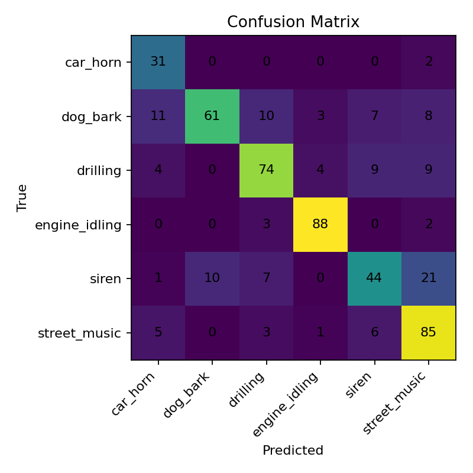

# ELEC5305 — HD-Level Final Project (UrbanSound8K Automobile Sounds)

# ELEC5305 — HD Final Project (Automobile Sound Recognition)

[](https://colab.research.google.com/drive/1UmBXJsQaG0xNVGXPCGg-ejU4b0tel4ij?usp=sharing)
*(Click the badge above to launch the full notebook in Google Colab)*  


**Author:** Tushar Manish Khupte (SID: 520330504)
**Unit:** ELEC5305 — Audio Processing & DSP, The University of Sydney

> Reproducible end-to-end pipeline for non-speech acoustic event recognition (automobile-centric).
> Includes **example inputs matched to outputs** so readers can *see and hear* what the model predicts.

---

## ✨ Key Features

* **Dataset automation**: auto-download & extract UrbanSound8K (or manual fallback).
* **Features**: log-mel spectrograms + auxiliary descriptors (ZCR, RMS, ModSpec summary, LPC).
* **Models**: `TinyCNNWithAux` and `CNN+BiLSTM` (set via `CFG["model"]`).
* **Regularisation**: SpecAugment, AdamW, deterministic seeds.
* **Early stopping on macro-F1** with model checkpointing (`best.pt`).
* **Fold protocol**: train=1–8, val=9, test=10.
* **Showcase**: saves per-class examples (PNG spectrogram + JSON probs + **WAV audio**).
* **Mistakes**: exports misclassified spectrograms (**+ WAVs**) for qualitative error analysis.
* **Artifacts**: confusion matrix (PNG/CSV), training curves, metrics JSON, logs CSV.
* **Inference helpers**: `predict_file()` & `batch_infer(folder)`.

---

## 📦 Repo Structure (important folders)

```
content/
 ├─ UrbanSound8K/                # dataset (auto-downloaded)
 ├─ outputs/
 │   ├─ training_log.csv
 │   ├─ metrics.json
 │   ├─ confusion_matrix.png     # + confusion_matrix.csv
 │   └─ examples/
 │       ├─ val_spectrograms/    # example spectrograms (validation)
 │       ├─ test_spectrograms/   # example spectrograms (test)
 │       ├─ test_mistakes_spectrograms/  # misclassified spectrograms
 │       ├─ test_mistakes_audio/         # misclassified audio (WAVs)
 │       ├─ some_examples_raw_Audio_INPUT/         # raw inputs (WAVs)
 │       ├─ some_examples_denoised_audio_OUTPUT/   # denoised outputs (WAVs)
 │       ├─ some_examples_Feature-Space_Reconstruction/ # mel recon (WAVs)
 │       └─ audio_pairs/          # input vs processed outputs + index.csv + README.md
 └─ us8k_cache/                   # cached mels, etc.
ultrasound_8k_Baseline_final_project.py      # main script
```

> If your folder names differ slightly, adjust the links below accordingly.

---

## ⚙️ Environment

Tested on Python 3.9+ (Colab/PyTorch default works). Minimal pinned set:

```
numpy==2.2.2
librosa==0.10.2.post1
soundfile==0.12.1
matplotlib==3.9.2
scikit-learn==1.6.1
tqdm==4.67.1
pywt==1.6.0
torch        # (Colab default ok)
```

Install (local):

```bash
pip install -r requirements.txt
# or:
pip install numpy==2.2.2 librosa==0.10.2.post1 soundfile==0.12.1 \
            matplotlib==3.9.2 scikit-learn==1.6.1 tqdm==4.67.1 pywt==1.6.0
```

---

## 🚀 How to Run

### 1) Train (default)

```bash
python ultrasound_8k_Baseline_final_project.py
```

* Uses folds: train=1–8, val=9, test=10
* Saves artifacts to `content/outputs/`
* **Fast demo**: set `CFG["fast_mode"]=True` (default). For full run, set `False`.

### 2) Generate plots only (no training)

```bash
python ultrasound_8k_Baseline_final_project.py --plot
```

Creates/refreshes:

* Regenerates `confusion_matrix.png` from CSV.

### 3) Export *audio pairs* (matched inputs vs processed outputs)

```bash
python ultrasound_8k_Baseline_final_project.py --audio 2
```

Writes per-class examples to:

```
content/outputs/examples/audio_pairs/
  <stem>__input.wav
  <stem>__denoised.wav
  <stem>__feature_recon.wav
  index.csv
  README.md   # mini gallery with <audio> players
```

### 4) Inference helpers (inside Python)

```python
from ultrasound_8k_Baseline_final_project import predict_file, batch_infer
predict_file("path/to/custom.wav")
batch_infer("folder/with/wavs")   # writes custom_batch_predictions.csv
```

---

## 🔊 Hear It (inputs matched to outputs)

> GitHub can play WAV via HTML5 `<audio>` in Markdown. Open the folders below and click files to preview.

* **Raw inputs (what the mic heard):**
  [`content/outputs/examples/some_examples_raw_Audio_INPUT/`](content/outputs/examples/some_examples_raw_Audio_INPUT/)

* **Denoised outputs (Wiener-like):**
  [`content/outputs/examples/some_examples_denoised_audio_OUTPUT/`](content/outputs/examples/some_examples_denoised_audio_OUTPUT/)

* **Feature-space reconstructions (approx. what the model “hears” via mel inversion):**
  [`content/outputs/examples/some_examples_Feature-Space_Reconstruction/`](content/outputs/examples/some_examples_Feature-Space_Reconstruction/)

* **Side-by-side pairs + index:**
  [`content/outputs/examples/audio_pairs/`](content/outputs/examples/audio_pairs/)
  (Open the generated `README.md` inside that folder for an embedded audio gallery.)

---

## 🧪 Results & Artifacts

**Global performance (test fold=10):** see `content/outputs/metrics.json` for full `classification_report`.

**Figure (ready for the report):**

* Confusion Matrix: 

**Mistake analysis (qualitative):**

* Spectrograms: [`content/outputs/examples/test_mistakes_spectrograms/`](content/outputs/examples/test_mistakes_spectrograms/)
* Audio (WAV): [`content/outputs/examples/test_mistakes_audio/`](content/outputs/examples/test_mistakes_audio/)

---

## 🧠 What are the three audios I export?

* `__input.wav` — **Raw input** from the dataset (trimmed/padded to 4 s at 22.05 kHz).
* `__denoised.wav` — Simple **Wiener-like denoising** to remove low-level background.
* `__feature_recon.wav` — **Mel-spectrogram inversion** back to waveform (approximation of the model’s percept).

This lets markers compare *original vs processed* and understand feature invariances.

---

## 📑 Reproducing the Paper-Quality Plots

1. Train once (or download `content/outputs/training_log.csv`).
2. Recreate plots/CM:

   ```bash
   python ultrasound_8k_Baseline_final_project.py --plot
   ```
3. Figures saved under `content/outputs/`.

---

## 🛠️ Configuration (quick switches)

Edit `CFG = {...}` at the top of `ultrasound_8k_Baseline_final_project.py`:

* `classes`: `["car_horn","engine_idling","siren","dog_bark","drilling","street_music"]`
* `model`: `"cnn_bilstm"` or `"tinycnn"`
* `fast_mode`: `True/False`
* `specaugment`, `use_modspec`, `use_lpc`, `use_wiener`
* Paths: `root`, `cache_dir`, `out_dir`

---

## 📚 Citations / References

1. Salamon, J., Jacoby, C., & Bello, J.P. **Urban Sound Datasets** (UrbanSound8K).
2. McFee, B., et al. **librosa: Audio and music signal analysis in Python**.
3. He, K., et al. **Deep Residual Learning for Image Recognition** (for conv best-practices).
4. Park, D.S., et al. **SpecAugment** (time/freq masking).
5. Kingma, D.P., Ba, J. **Adam**; Loshchilov, I., Hutter, F. **AdamW**.
6. Graves, A., Schmidhuber, J. **Framewise phoneme classification with bidirectional LSTM**.
7. Rabiner, L. **On LPC and speech analysis**.
8. Hurley, N., Rickard, S. **Modulation spectra for audio characterization**.
9. Bishop, C.M. **Pattern Recognition and Machine Learning** (F1 & evaluation).
10. Scikit-learn developers. **Classification report & metrics**.

> Dataset license/credit is inherited from UrbanSound8K’s Freesound sources; use sample audio solely for academic demonstration.

---

## 🔐 License & Usage

* **Code**: Your preferred open-source license (e.g., MIT).
* **Audio**: UrbanSound8K clips remain under their original licenses—do not redistribute outside academic use.

---

## 🙌 Acknowledgements

* USYD ELEC5305 teaching team and markers.
* Open-source libraries: PyTorch, librosa, scikit-learn, matplotlib, tqdm.

---

## ❓FAQ

**Q: I don’t see audio pairs after training.**
A: Run: `ultrasound_8k_Baseline_final_project.py --audio 2` (adjust `2` to export N examples per class).

**Q: GitHub won’t play an audio file in-place.**
A: Open the WAV in a new tab or download; or browse the embedded gallery inside `audio_pairs/README.md`.

**Q: Where are misclassified clips?**
A: `content/outputs/examples/test_mistakes_audio/` (plus spectrograms in the sibling folder).

---

*Happy listening—and enjoy exploring the model’s decisions with matched inputs & outputs!*
