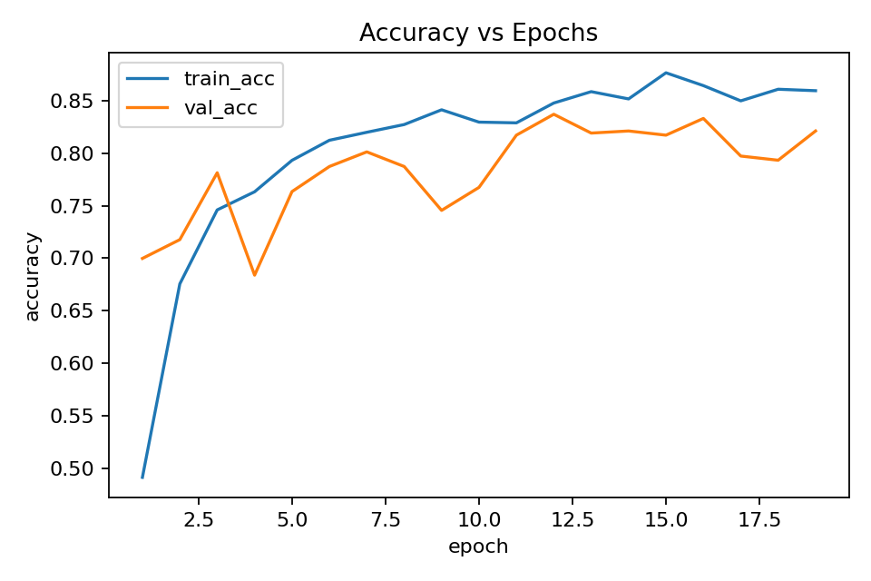
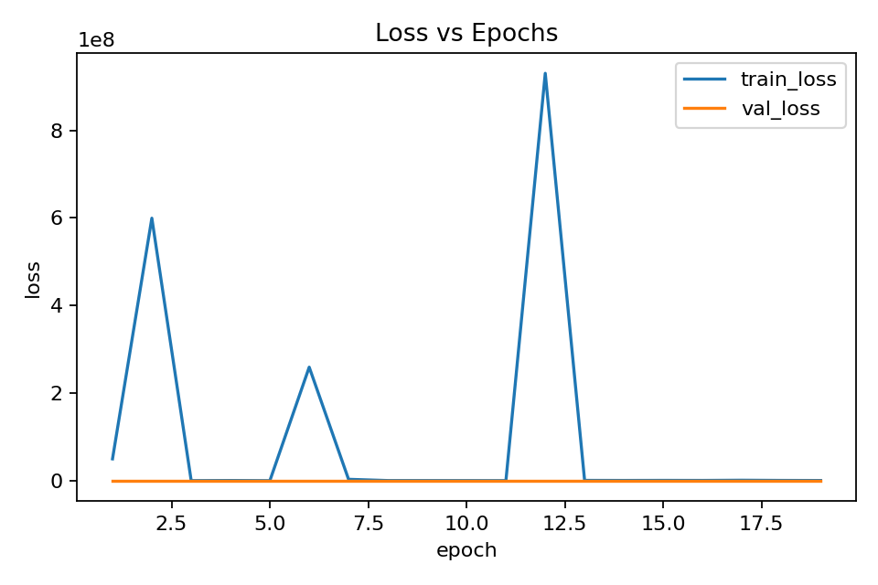
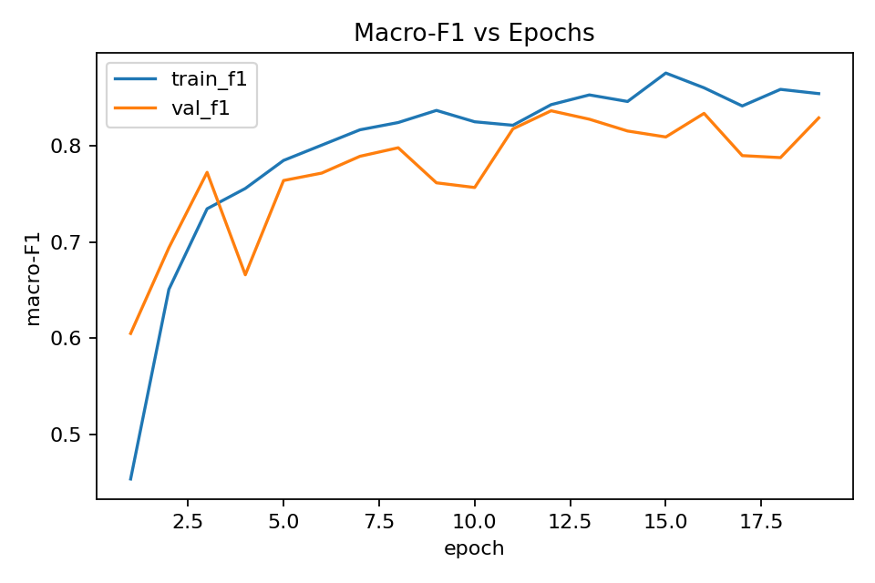
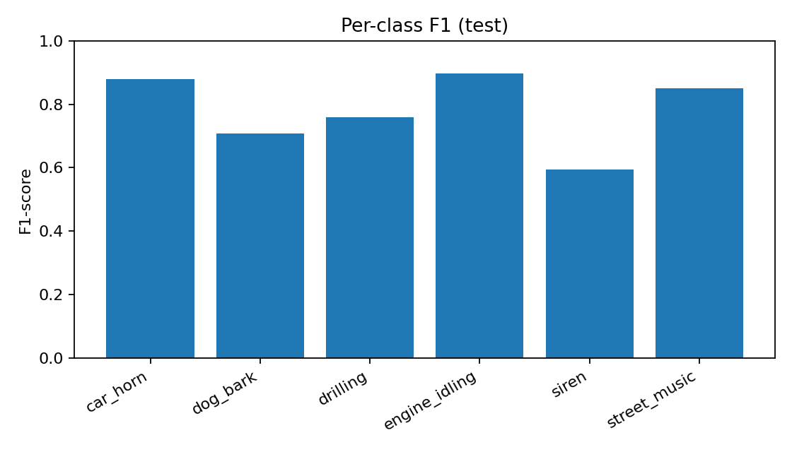

# 🔊 ELEC5305 — Automobile Sound Recognition  
### Hybrid CNN–BiLSTM Model with Auxiliary Audio Features

**Author:** Tushar Manish Khupte (SID: 520330504)  
**Unit:** ELEC5305 – Audio Processing & DSP  
**The University of Sydney**

[](https://colab.research.google.com/drive/1tQ3kxnaScF5GZLx7VYJQ2cxjm3pbHZN9?usp=sharing)

---

## 📘 Overview

This website presents my **individual ELEC5305 final project**, where I design and evaluate a **CNN–BiLSTM hybrid model** for UrbanSound8K automobile-related sound recognition.

The project includes:

- ✔ Log-mel spectrogram features  
- ✔ Auxiliary acoustic features (ZCR, RMS, Modulation Spectrum, LPC)  
- ✔ A hybrid **CNN → BiLSTM** temporal architecture  
- ✔ Early stopping using **macro-F1**  
- ✔ Auto-exported training curves, confusion matrix, and audio examples  
- ✔ Audio reconstruction to understand “what the model hears”

---

# 🎧 Key Outputs

## 📊 Confusion Matrix


---

## 📈 Training Curves

### **Accuracy**


### **Loss**


### **Macro-F1**


### **Per-Class F1**


---

# 🔉 Audio Example Explorer

These folders contain audio samples exported during evaluation.

### 🎧 Raw Input Audio
`content/outputs/examples/some_examples_raw_Audio_INPUT/`

### 🔉 Denoised (Wiener) Audio
`content/outputs/examples/some_examples_denoised_audio_OUTPUT/`

### 🎼 Mel-Reconstructed Audio  
*(Approximation of what the model “hears”)*  
`content/outputs/examples/some_examples_Feature-Space_Reconstruction/`

### 🎚️ Matched Audio Triplets  
**Input → Denoised → Mel-Recon**  
`content/outputs/examples/audio_pairs/`

---

# 🧠 Model Summary

| Component | Description |
|----------|-------------|
| **Baseline** | TinyCNNWithAux (lightweight CNN + aux features) |
| **Proposed Model** | **CNN → BiLSTM** + auxiliary features |
| **Loss** | Cross-entropy |
| **Optimizer** | AdamW |
| **Metric for Early Stopping** | Macro-F1 on validation fold |
| **Train Folds** | 1–8 |
| **Validation** | Fold 9 |
| **Test** | Fold 10 |
| **Best Checkpoint** | `content/outputs/best.pt` |

---

# 📦 Repository Structure

```text
content/
 ├─ UrbanSound8K/                
 ├─ outputs/
 │   ├─ confusion_matrix.png
 │   ├─ plot_accuracy.png
 │   ├─ plot_loss.png
 │   ├─ plot_macro_f1.png
 │   ├─ plot_per_class_f1.png
 │   ├─ training_log.csv
 │   ├─ metrics.json
 │   └─ examples/
 │       ├─ some_examples_raw_Audio_INPUT/
 │       ├─ some_examples_denoised_audio_OUTPUT/
 │       ├─ some_examples_Feature-Space_Reconstruction/
 │       └─ audio_pairs/
 │
 └─ us8k_cache/

ultrasound_8k_baseline_final_project.py   # Main pipeline script
